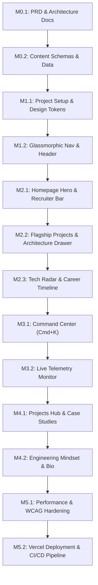

# Section 4: Development Roadmap & Milestone Execution Plan

**Document Status:** Final Draft / Pending User Approval  
**Role:** Senior Staff Software Engineer, Technical Lead, Project Manager  
**Project:** SaaS-Grade Developer Portfolio Website  

---

### 1. Overview & Execution Philosophy

The development process is structured into **small, reviewable, deterministic milestones**. Implementation follows a strict **Quality Gate Strategy**: no milestone begins until the previous milestone satisfies its explicit Definition of Done (DoD) and passes all quality checks.

---

### 2. Git Strategy & Commit Conventions (Solo Senior Developer Workflow)

#### 2.1 Branching Model
- **`main`:** Protected production branch. Every commit must pass CI/CD static checks and automated tests.
- **`feature/<milestone-id>-<feature-name>`:** Short-lived feature branches created for each milestone (e.g., `feature/m1.1-project-init`, `feature/m3.1-command-palette`).

#### 2.2 Conventional Commit Standard
All commit messages must follow the [Conventional Commits](https://www.conventionalcommits.org/) specification:
- `feat(scope):` New user-facing feature or component
- `fix(scope):` Bug fix or regression patch
- `docs(scope):` Documentation update or PRD modification
- `style(scope):` Formatting, visual design token adjustment, or CSS cleanup
- `refactor(scope):` Code restructuring without functional changes
- `perf(scope):` Performance tuning, dynamic imports, or bundle optimization
- `test(scope):` Adding unit, E2E, or accessibility tests
- `chore(scope):` Tooling configuration, dependency updates, or CI build scripts

#### 2.3 Pull Request Quality Gate Checklist
Before merging any feature branch into `main`, the PR must pass:
1. `npm run lint` — Zero ESLint errors or warnings.
2. `npm run type-check` — Zero TypeScript compilation errors (`tsc --noEmit`).
3. `npm run test` — All unit and integration tests passing.
4. `npm run build` — Successful static export / production build with zero warnings.
5. Manual keyboard accessibility & mobile layout inspection.

---

### 3. Phase 0: Product Planning & Documentation Milestones

#### Milestone M0.1: Product & Architectural Blueprint (Current)
- **Objective:** Finalize PRD, Information Architecture, Technical Architecture, and Development Roadmap.
- **Deliverables:** `PRD.md`, `SECTION_2_IA_AND_UX_SPECIFICATION.md`, `SECTION_3_TECHNICAL_ARCHITECTURE.md`, `SECTION_4_ROADMAP_AND_MILESTONES.md`.
- **Dependencies:** None.
- **Acceptance Criteria:** 100% agreement on PRD goals, sitemap, wireframes, tech stack, directory layout, and roadmap.
- **Risks:** Scope creep or missing non-functional targets.
- **Complexity:** Low.
- **Verification Checklist:**
  - [x] PRD created & saved.
  - [x] Information Architecture & Wireframes created & saved.
  - [x] Technical Architecture created & saved.
  - [x] Milestone Roadmap created & saved.
- **Definition of Done (DoD):** User explicit sign-off on all documentation sections.

---

#### Milestone M0.2: Content Database & TypeScript Schemas
- **Objective:** Define strict TypeScript interfaces and construct the typed static content database (`projects.ts`, `experience.ts`, `skills.ts`).
- **Deliverables:**
  - `src/types/project.ts`, `src/types/experience.ts`, `src/types/telemetry.ts`
  - `src/content/projects.ts` (Structured records for 3 flagship projects)
  - `src/content/experience.ts` (Structured records for career roles & ADR logs)
  - `src/content/skills.ts` (Categorized tech radar entries)
- **Dependencies:** M0.1.
- **Acceptance Criteria:** Valid static JSON/TS data structures with zero placeholder strings; verified against TypeScript compiler.
- **Risks:** Incomplete project metrics or unformatted code snippets.
- **Complexity:** Medium.
- **Verification Checklist:**
  - [ ] All TypeScript types compile without errors.
  - [ ] Real-world project metrics, descriptions, and ADR logs populated.
- **Definition of Done (DoD):** Data files pass `tsc --noEmit` validation cleanly.

---

### 4. Phase 1: Core Foundation & Layout Infrastructure

#### Milestone M1.1: Project Setup & Design System Tokens
- **Objective:** Initialize Next.js 14+ App Router project, configure Tailwind CSS near-black theme tokens, typography, and developer tooling.
- **Deliverables:**
  - `package.json`, `tsconfig.json`, `tailwind.config.ts`, `next.config.mjs`
  - `src/styles/globals.css` with CSS custom properties (`--bg-canvas: #09090b`, `--bg-surface-1: #121215`, `--accent-violet: #8b5cf6`)
  - Configured font loaders (`Inter` / `Geist` & `JetBrains Mono`)
- **Dependencies:** M0.2.
- **Acceptance Criteria:** Next.js dev server boots smoothly; global CSS tokens correctly render obsidian near-black background and violet accents.
- **Risks:** FOUC (Flash of Unstyled Content) on initial load or font loading layout shifts.
- **Complexity:** Low.
- **Verification Checklist:**
  - [ ] `npm run dev` builds cleanly without warnings.
  - [ ] Fonts load with zero layout shift (CLS = 0).
- **Definition of Done (DoD):** Skeleton app boots and displays tokenized styles cleanly.

---

#### Milestone M1.2: Glassmorphic Header & Responsive Navigation
- **Objective:** Build fixed glassmorphic top navigation header, desktop menu, logo status pill, and mobile bottom slide-up navigation sheet.
- **Deliverables:**
  - `src/components/shared/header.tsx`
  - `src/components/shared/mobile-nav.tsx`
  - `src/components/shared/footer.tsx`
  - `src/app/(main)/layout.tsx`
- **Dependencies:** M1.1.
- **Acceptance Criteria:** Header remains fixed with 12px blur; mobile menu slides up smoothly from bottom on small screens; keyboard tab navigation works flawlessly.
- **Risks:** Z-index conflicts or mobile viewport height (`100vh`) visual bugs.
- **Complexity:** Medium.
- **Verification Checklist:**
  - [ ] Header blur renders cleanly without blocking content.
  - [ ] Mobile navigation sheet functions on 320px–768px viewports.
- **Definition of Done (DoD):** Fully responsive, keyboard-accessible header and footer merged to `main`.

---

### 5. Phase 2: Core Homepage & Feature Modules

#### Milestone M2.1: Homepage Hero & Recruiter Quick-Actions Bar
- **Objective:** Build executive hero section with high-impact headline, live availability badge, and 1-click Recruiter Quick Actions.
- **Deliverables:**
  - `src/components/features/hero/hero-section.tsx`
  - `src/components/features/hero/recruiter-bar.tsx`
  - `src/components/features/hero/availability-badge.tsx`
- **Dependencies:** M1.2.
- **Acceptance Criteria:** 1-Click "Download Resume" triggers file download; 1-Click "Copy Email" copies address and displays accessible feedback pill; 0-click project visibility on scroll.
- **Risks:** Clipboard API permission errors on untrusted browser environments.
- **Complexity:** Low to Medium.
- **Verification Checklist:**
  - [ ] Resume download link fires correctly.
  - [ ] Email copy interaction triggers screen reader announcement (`aria-live`).
- **Definition of Done (DoD):** Hero section live and verified across desktop & mobile viewports.

---

#### Milestone M2.2: Flagship Projects Grid & Architecture Inspector Drawer
- **Objective:** Build Flagship Projects cards featuring live impact metrics, tech stack tags, and slide-over Radix Sheet for system architecture specs.
- **Deliverables:**
  - `src/components/features/projects/project-grid.tsx`
  - `src/components/features/projects/project-card.tsx`
  - `src/components/features/projects/architecture-drawer.tsx`
  - `src/components/features/projects/system-diagram.tsx`
- **Dependencies:** M2.1.
- **Acceptance Criteria:** Clicking "Inspect Architecture" opens slide-over drawer smoothly; drawer displays interactive data flow diagram and ADR specs; Esc key closes drawer cleanly.
- **Risks:** Slow SVG diagram rendering or layout overflow on narrow mobile screens.
- **Complexity:** High.
- **Verification Checklist:**
  - [ ] Slide-over drawer traps focus properly while open.
  - [ ] Diagram renders crisply with zero layout shift.
- **Definition of Done (DoD):** Projects grid & drawer fully interactive with 100% keyboard support.

---

#### Milestone M2.3: Tech Radar & Career Matrix Timeline
- **Objective:** Implement categorized Tech Radar skill matrix and interactive chronological career timeline with expandable role ADRs.
- **Deliverables:**
  - `src/components/features/projects/tech-radar.tsx`
  - `src/components/features/experience/experience-timeline.tsx`
  - `src/components/features/experience/role-card.tsx`
  - `src/app/(main)/experience/page.tsx`
- **Dependencies:** M2.2.
- **Acceptance Criteria:** Career timeline displays roles in reverse chronological order; expanding role cards reveals bullet points with bolded metrics and engineering trade-offs.
- **Risks:** Excessive accordion animation height reflows.
- **Complexity:** Medium.
- **Verification Checklist:**
  - [ ] Skills grid formatted cleanly across 1, 2, and 3-column layouts.
  - [ ] Timeline expandables work smoothly via keyboard.
- **Definition of Done (DoD):** Tech Radar and Experience views merged to `main`.

---

### 6. Phase 3: Interactive SaaS Features & Telemetry

#### Milestone M3.1: Command Center (`Cmd + K`) Spotlight Menu
- **Objective:** Implement global Raycast/Linear style command palette powered by `cmdk` with fuzzy search, instant routing, and quick action shortcuts.
- **Deliverables:**
  - `src/components/shared/command-palette.tsx`
  - `src/hooks/use-command-palette.ts`
- **Dependencies:** M2.3.
- **Acceptance Criteria:** Pressing `Cmd+K` or `Ctrl+K` opens modal anywhere on site; typing filters navigation options instantly; selecting item executes navigation or action.
- **Risks:** Event listener leaks or conflict with native browser shortcuts.
- **Complexity:** High.
- **Verification Checklist:**
  - [ ] Shortcuts work seamlessly on Mac (`⌘K`) and Windows (`Ctrl+K`).
  - [ ] Component dynamically imported without adding weight to initial page load.
- **Definition of Done (DoD):** `Cmd+K` modal operational with zero console warnings.

---

#### Milestone M3.2: Live Telemetry Monitor & Vitals Drawer
- **Objective:** Build real-time client-side performance monitor calculating FPS, route latency, and Web Vitals metrics in a persistent bottom drawer.
- **Deliverables:**
  - `src/components/features/telemetry/performance-monitor.tsx`
  - `src/components/features/telemetry/vitals-drawer.tsx`
  - `src/hooks/use-telemetry.ts`
- **Dependencies:** M3.1.
- **Acceptance Criteria:** Status bar shows active FPS and simulated route latency; clicking status bar opens detailed Vitals telemetry panel; zero CPU/GPU overhead from sampling.
- **Risks:** High memory footprint if `requestAnimationFrame` listener is not properly cleaned up.
- **Complexity:** High.
- **Verification Checklist:**
  - [ ] FPS counter pauses when tab is in background (conserving battery).
  - [ ] Telemetry sampler adds < 0.1ms overhead to main thread.
- **Definition of Done (DoD):** Telemetry monitor integrated and benchmarked cleanly.

---

### 7. Phase 4: Dynamic Routes & Secondary Pages

#### Milestone M4.1: Projects Hub (`/projects`) & Detailed Case Study Pages (`/projects/[id]`)
- **Objective:** Construct filterable projects catalog and dynamic case study reader with dynamic OpenGraph image generation.
- **Deliverables:**
  - `src/app/(main)/projects/page.tsx`
  - `src/app/(main)/projects/[id]/page.tsx`
  - `src/app/api/og/route.tsx`
- **Dependencies:** M3.2.
- **Acceptance Criteria:** `/projects` category tabs filter projects instantaneously; `/projects/[id]` renders deep-dive case studies with code highlights; `/api/og` returns dynamic social banners.
- **Risks:** Edge runtime limits on dynamic OG SVG font rendering.
- **Complexity:** Medium to High.
- **Verification Checklist:**
  - [ ] All dynamic project routes pass static export / build checks.
  - [ ] Social share preview images generate correctly.
- **Definition of Done (DoD):** Dynamic case study pages live with full SEO metadata.

---

#### Milestone M4.2: Engineering Mindset & Bio View (`/about`)
- **Objective:** Build engineering philosophy cards, professional background narrative, and developer tooling setup page.
- **Deliverables:**
  - `src/app/(main)/about/page.tsx`
  - `src/components/features/about/philosophy-cards.tsx`
  - `src/components/features/about/tooling-grid.tsx`
- **Dependencies:** M4.1.
- **Acceptance Criteria:** Clean typography layout showcasing core engineering tenets and daily driver stack; responsive grid across all devices.
- **Risks:** None.
- **Complexity:** Low.
- **Verification Checklist:**
  - [ ] Content proofread and structured cleanly.
- **Definition of Done (DoD):** `/about` page merged to `main`.

---

### 8. Phase 5: Hardening, Audits & Production Release

#### Milestone M5.1: Performance Hardening & WCAG Accessibility Audit
- **Objective:** Execute strict Lighthouse performance optimizations, bundle tree-shaking, and Playwright + axe-core automated WCAG 2.1 AA audits.
- **Deliverables:**
  - `tests/accessibility.spec.ts`
  - `tests/performance.spec.ts`
  - Configured CSP headers in `next.config.mjs`
- **Dependencies:** M4.2.
- **Acceptance Criteria:** 95+ score across all 4 Lighthouse categories (Performance, Accessibility, Best Practices, SEO); 0 accessibility violations reported by axe-core.
- **Risks:** Unexpected CLS or color contrast failures on custom dark tokens.
- **Complexity:** High.
- **Verification Checklist:**
  - [ ] Lighthouse Performance score ≥ 95.
  - [ ] Lighthouse Accessibility score = 100.
  - [ ] Core Web Vitals targets verified (`LCP < 1.2s`, `INP < 50ms`, `CLS < 0.01`).
- **Definition of Done (DoD):** All automated audit suites passing with 100% green status.

---

#### Milestone M5.2: Production Deployment & CI/CD Pipeline
- **Objective:** Deploy application to Vercel Edge Platform, configure GitHub Actions workflow, and setup custom domain.
- **Deliverables:**
  - `.github/workflows/ci.yml`
  - Vercel production deployment setup
  - Custom domain SSL & security configuration
- **Dependencies:** M5.1.
- **Acceptance Criteria:** Zero-downtime deployment; continuous integration pipeline automatically runs linter, type-check, and tests on push.
- **Risks:** Environment variable misconfiguration or DNS propagation delays.
- **Complexity:** Low to Medium.
- **Verification Checklist:**
  - [ ] Live URL loads in < 1 second globally.
  - [ ] Security headers (CSP, HSTS, X-Frame-Options) verified on securityheaders.com.
- **Definition of Done (DoD):** Live production deployment active and operational.

---

### 9. Master Project Timeline & Dependency Graph

---
