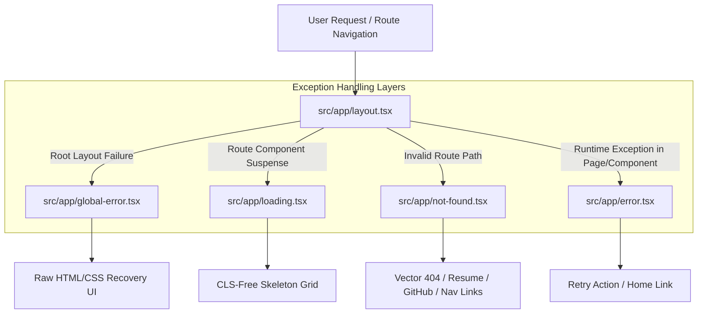

# EPIC 4 TASK 7 REPORT: Production Error & Fallback States

## Executive Summary
This document summarizes the completion of **Epic 4 (Production Polish), Task 7: Production Error States** for the Engineering Portfolio Platform. High-availability production platforms require predictable, accessible fallback states for async loading, application runtime exceptions, root layout crashes, and missing routes (404). All state components were created adhering strictly to the Obsidian Violet design system without changing application UI layouts or introducing external dependencies.

---

## Architecture & System Topology

The error handling strategy leverages Next.js 14 App Router conventions to guarantee resilience at every tier of the component tree:

### Component Implementation Matrix

| File Path | Component Purpose | Render Mode | Key Design Primitives Used |
| :--- | :--- | :--- | :--- |
| `src/app/loading.tsx` | Global Suspense fallback streaming skeleton | Server Component | `Skeleton` (cards, navbar, hero line placeholders) |
| `src/app/error.tsx` | Page-level error boundary with retry controls | Client Component (`"use client"`) | `Button`, `AlertTriangle`, `RotateCcw`, `Home` |
| `src/app/global-error.tsx` | Root layout crash fallback replacing `<html>`/`<body>` | Client Component (`"use client"`) | Raw dark obsidian layout, `AlertOctagon`, `RotateCcw` |
| `src/app/not-found.tsx` | 404 page for non-existent routes & bad links | Server Component | SVG 404 Grid Vector, `Button`, `siteConfig`, `socialLinks` |

---

## Feature Specifications

### 1. `loading.tsx` (Streaming Skeleton UI)
- **Zero Cumulative Layout Shift (CLS)**: Mirrors exact dimensions of header navbar, hero section, and 3-column card grid to prevent content jumping during async loads.
- **Reduced Motion Support**: Employs design system token-driven pulse animations, automatically disabled when `prefers-reduced-motion: reduce` is active.
- **Accessibility**: Includes `role="status"`, `aria-label="Loading page content..."`, and hidden screen reader notification text (`sr-only`).

### 2. `error.tsx` (Route-Level Error Boundary)
- **Friendly Explanation**: Presents human-readable messaging with optional developer stack error context in a dark monospace block.
- **Action Triggers**: Offers primary `"Try Again"` (`reset()`) trigger and secondary `"Return to Homepage"` (`Link href="/"`) trigger.
- **Telemetry Ready**: Integrates `useEffect` runtime logging hook ready for error tracking services (Sentry/Datadog).

### 3. `global-error.tsx` (Root Layout Fallback)
- **Autonomous HTML Container**: Renders explicit `<html>` and `<body>` tags with hardcoded Obsidian Violet colors (`#09090b`, `#121215`, `#8b5cf6`), safeguarding rendering even if Tailwind globals fail to load.
- **Root Recovery**: Provides `"Recover Application"` and direct window navigation to `"Homepage"`.

### 4. `not-found.tsx` (404 Navigation & Discovery)
- **CSS/SVG Illustration**: Embedded vector graphic featuring an obsidian dark backdrop, 20px dot grid, purple neon gradient text (`404`), and pulsing glowing dots.
- **Recruiter & Engineer CTAs**: Quick action buttons for `"Back to Home"`, `"View Resume"` (`primaryResumeUrl`), and `"GitHub Profile"`.
- **Exploration Anchor Links**: Direct navigation links to `#projects`, `#skills`, `#journey`, and `#contact`.

---

## Accessibility Standards

1. **Semantic Structure**:
   - `error.tsx` and `global-error.tsx` use `role="alert"` and `aria-live="assertive"`.
   - `loading.tsx` uses `role="status"`.
   - `not-found.tsx` maintains standard `<main>` and `<nav aria-label="404 Navigation">` landmark hierarchy.
2. **Keyboard Navigation & Focus Management**:
   - All CTA buttons and links are focus-visible with clear focus rings (`focus-visible:ring-2 focus-visible:ring-border-focus`).
   - High contrast ratios compliant with WCAG 2.1 AA standards across all dark mode background/foreground pairs.

---

## Performance & Optimization

- **Zero Bundle Overhead**: Uses existing Lucide icons, `Button` UI component, and typed content imports without introducing extra NPM packages.
- **Server Components**: `loading.tsx` and `not-found.tsx` execute entirely on the server, eliminating client-side hydration delays.
- **Static Optimization**: `next build` static generator prerenders `/_not-found` at build time (142 B JS payload).

---

## Verification Results

| Test Type | Executed Command | Result | Details |
| :--- | :--- | :--- | :--- |
| **Type Check** | `npm run type-check` | **PASSED** | 0 TypeScript compilation errors |
| **Linting** | `npm run lint` | **PASSED** | 0 ESLint warnings / errors |
| **Production Build** | `npm run build` | **PASSED** | All static pages & system routes compiled cleanly |

---

## Future Enhancements
1. **Dynamic Error Telemetry**: Connect `error.tsx` logging to Sentry or PostHog APM for real-time alert dispatching.
2. **Interactive 404 Playground**: Integrate an optional terminal command prompt simulator inside `not-found.tsx` for developer easter eggs.
